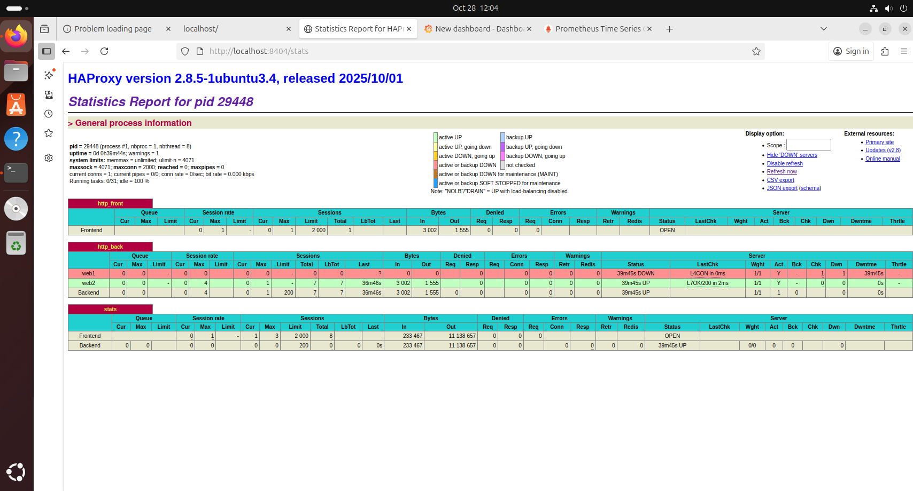
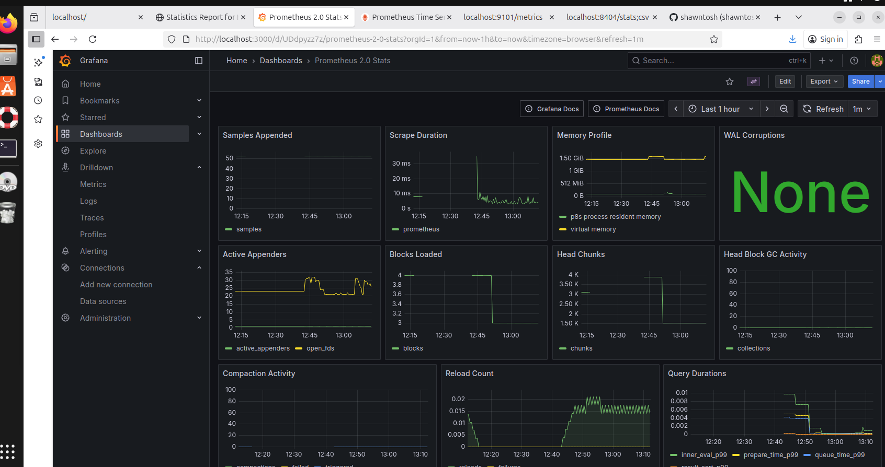

# 🧠 SRE Monitoring Stack – HAProxy + Prometheus + Grafana

This project is a **production-style monitoring stack** for learning and practicing **DevOps/SRE workflows**.  
It includes complete integration between **HAProxy**, **Prometheus**, **Grafana**, and the **HAProxy Exporter**.

---

## 🚀 Stack Components
| Component | Purpose | URL |
|------------|----------|------|
| HAProxy | Load balancer + traffic manager | http://localhost:8404 |
| HAProxy Exporter | Exposes HAProxy metrics for Prometheus | http://localhost:9101/metrics |
| Prometheus | Scrapes and stores metrics | http://localhost:9090 |
| Grafana | Visualizes metrics and dashboards | http://localhost:3000 |

---

## ⚙️ Folder Structure

 ## ▶️ Usage
Start all services:
```bash
cd scripts
./start_monitoring.sh

## Project Screenshots

### HAProxy Dashboard
<p align="center">
  
</p>

### Grafana Dashboard
<p align="center">
  
</p>

